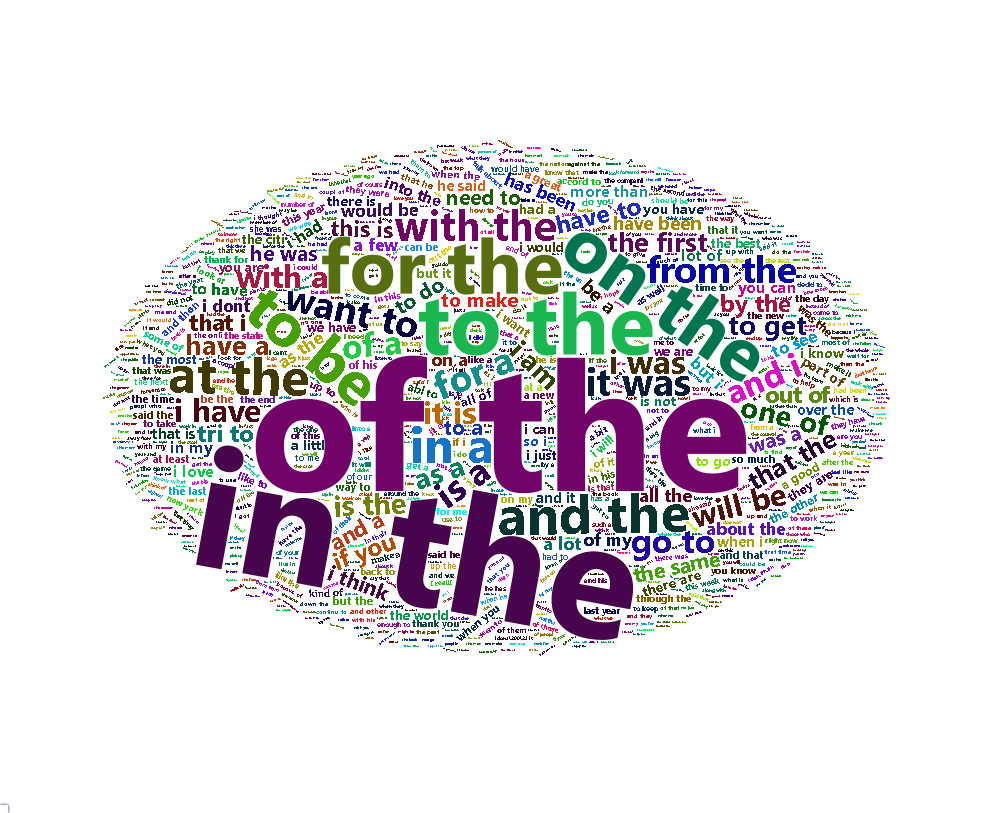
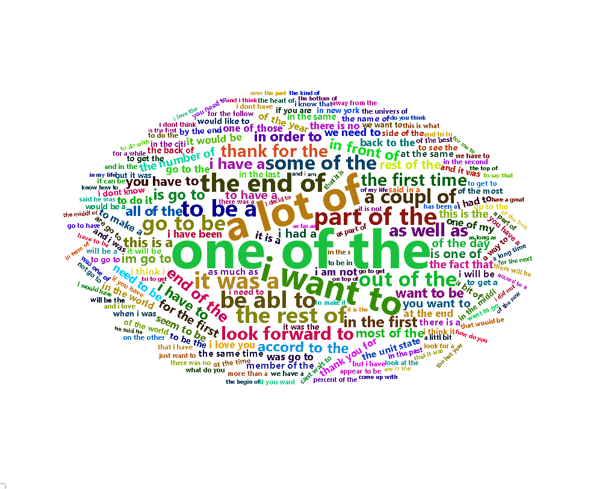
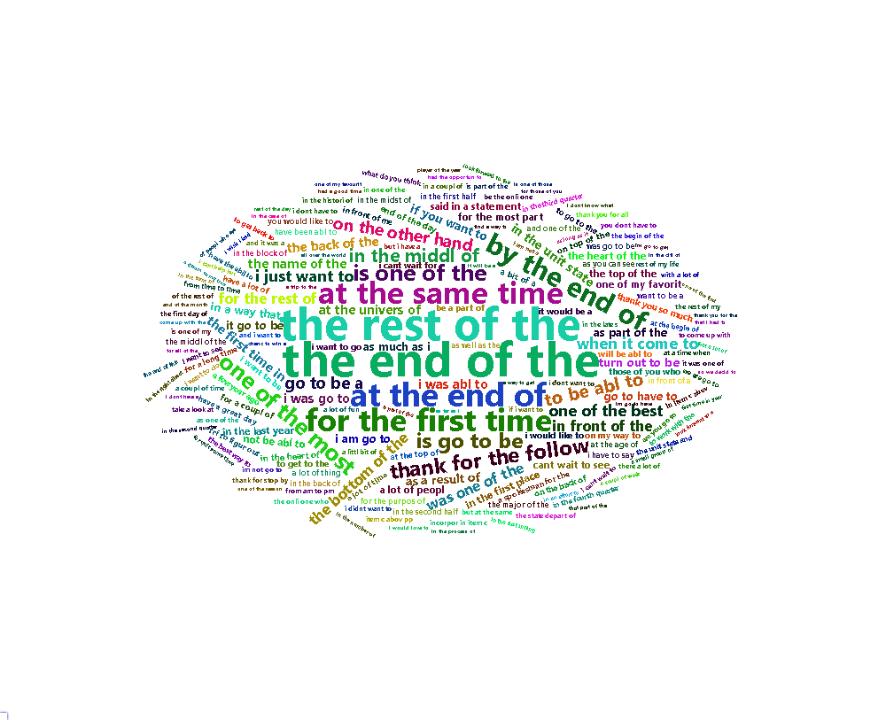
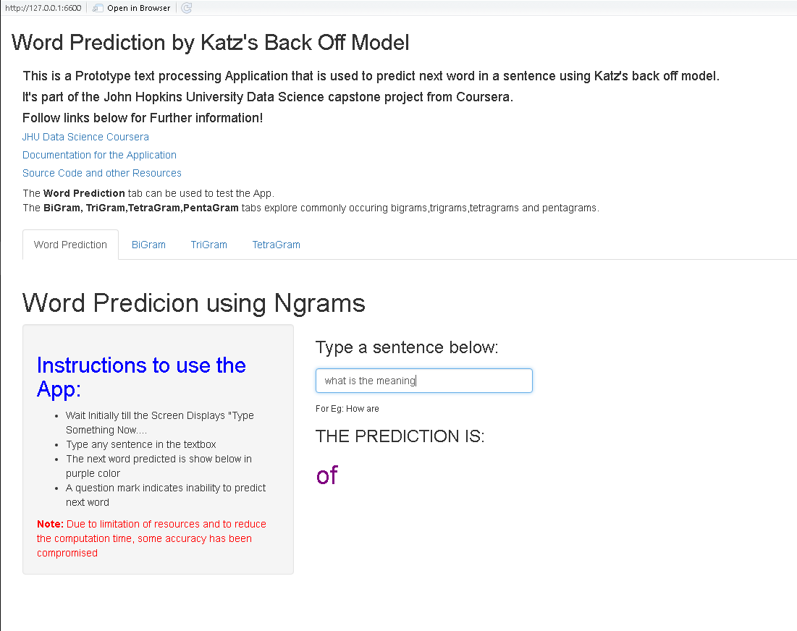

# JHU-NLP-Capstone

# Introduction & Understanding the Problem:
Around the world, people are spending an increasing amount of time on their mobile devices for email, social networking, banking and a whole range of other activities. But typing on mobile devices can be a serious pain. SwiftKey, our corporate partner in this capstone, builds a smart keyboard that makes it easier for people to type on their mobile devices. One cornerstone of their smart keyboard is predictive text models. When someone types:

I went to the

the keyboard presents three options for what the next word might be. For example, the three words might be gym, store, restaurant.
Here, We build Predictive Ngram (2-gram, 3-gram, 4-gram, and 5-gram) models based on Katz's Back off model and integrate it in an application which is the end product.

This project is the capstone project of [Data Science Specialization](https://www.coursera.org/specializations/jhu-data-science) course provided by JHU on Coursera.

The final Application predicts next word, given a set of words by a user as input. It's hosted on shinyapps.io
Click [here](https://himankjn.shinyapps.io/JHU_Capstone/) to directly go to the Application.

#### Tokenization and Cleaning has been done in tokenizationandcleaning.R file.

#### The Ngrams have been computed in ngrams.R file

#### A function called ngrams is created in prediction.R file which predicts next word given an input string. It uses output from ngram.R file 

## The FinalReport.pdf/html file contains the whole summary of Project.

## Word Clouds of Most frequent ngrams.

# R Dependencies:

sudo apt-get install libcurl4-openssl-dev

sudo apt-get install libxml2-dev

sudo apt-get install libxml2

sudo apt-get install libssl-dev 

c("dplyr", "rlang","xml2","stringi","stringr","tm")

Download Dependencies by following one liner:

sudo R -e 'install.packages(c("dplyr","xml2", "rlang","stringi","stringr","tm"), lib="/usr/local/lib/R/site-library")' 

# Final Application, Documentation & Resources:

Finally, After model building I used R shinyApp interface to integrate the katz's back off model to build a predictive application that is hosted on shinyapps.io

## Applicaton: 
## [Final Application](https://himankjn.shinyapps.io/JHU_Capstone/)

## Application Image Demo:
## 

## Pitch Deck: 
## [Pitch](http://rpubs.com/himank369123/JHUCAPSTONE)

## Resources and files:
## [Project Github Repo](https://github.com/himankjn/JHU-NLP-Capstone)

## Github Pages:
## [GitPages](https://himankjn.github.io/WordPrediction/)

# Thank You

